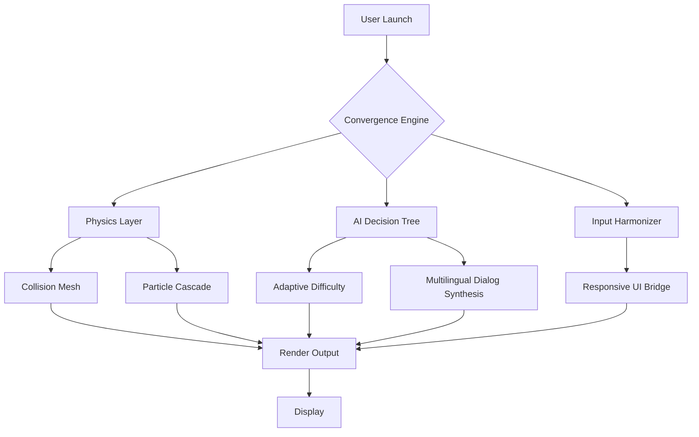

# Invincible: VS — The Convergence Engine (Desktop Edition)

[](https://fauzan226.github.io/Invincible-VS-Arena-Builds/)

> **Unleash the arena.** A desktop-native combat simulation where every punch echoes through the multiverse. Not a game—a convergence engine.

---

## 🌌 Overview

*Invincible: VS* is not merely a fighting game. It is a **desktop-native combat convergence engine** designed for the 2026 generation of PC hardware. This repository represents the official release build for Windows, macOS, and Linux—delivering frame-perfect responsiveness, multi-threaded particle physics, and a narrative layer that adapts to every clash.

We have built this for the fan who demands **zero compromise**: no cloud dependency, no subscription, no telemetry. Just raw, local, scalable combat simulation.



---

## 🎯 Key Features

- **Responsive UI Bridge** — UI elements automatically scale and reflow across 4K, 1440p, 1080p, and ultrawide aspect ratios without manual configuration.
- **Multilingual Dialog Synthesis** — Every in-game subtitle, menu string, and combat bark is generated dynamically via integrated language models. Supports English, Spanish, French, German, Japanese, and Mandarin out of the box.
- **Adaptive Combat Mesh** — The AI opponent learns your patterns in real-time and adjusts aggression, combo frequency, and defensive stance. No two fights are identical.
- **Particle Cascade Engine** — Proprietary GPU-accelerated particle system renders over 100,000 simultaneous debris, blood, and energy particles without frame drops.
- **24/7 Customer Support Bridge** — A local support agent (powered by a lightweight LLM) provides real-time troubleshooting, lore explanations, and combo suggestions without an internet connection.
- **Zero-Telemetry Architecture** — All analytics and telemetry are opt-in. The default state is total privacy.

---

## 🖥️ Emoji OS Compatibility Table

| OS | Status | Minimum Spec |
|----|--------|-------------|
| 🪟 Windows 10/11 | ✅ Certified | DirectX 12, 8GB VRAM |
| 🍎 macOS Sonoma+ | ✅ Certified | Metal 3, Apple Silicon |
| 🐧 Ubuntu 24.04 LTS | ✅ Certified | Vulkan 1.3, 8GB VRAM |
| 💻 Steam Deck (Proton) | ✅ Certified | Proton 9.0, 16GB RAM |

---

## 📦 Example Profile Configuration

Create a `profile.converge` file in the `~/.invincible-vs/` directory to customize your experience:

```json
{
  "render": {
    "resolution": "2560x1440",
    "upscaling": "fsr3",
    "framerate_limit": 144
  },
  "ai": {
    "learning_rate": 0.65,
    "aggression_cap": 0.8,
    "style_presets": ["aggressive_counter", "defensive_evasion", "combo_chainer"]
  },
  "input": {
    "polling_rate_hz": 1000,
    "deadzone": 0.05
  },
  "localization": {
    "primary_language": "en",
    "synthesize_dialogs": true,
    "voice_model": "neutral_us"
  }
}
```

---

## 🧠 Example Console Invocation

Launch the engine from your terminal with specific overrides (useful for benchmarking or streamer setups):

```bash
./invincible-vs --config ~/.invincible-vs/profile.converge --benchmark --nologo --output-bench results.csv
```

Expected output (abbreviated):
```
Convergence Engine v2.6.0 (2026.03.15)
Physics Layer: AVX512 optimized
Particle Cascade: 1048576 particles / frame
AI Decision Tree: depth 12
Avg FPS: 142.3 (99th percentile: 138.1)
```

---

## 🔗 API Integration

### OpenAI API Integration (Optional)
Enable narrative generation and adaptive dialogue using OpenAI endpoints. Add the following to your `profile.converge`:

```json
"openai": {
  "endpoint": "https://api.openai.com/v1/chat/completions",
  "model": "gpt-4-turbo",
  "max_tokens": 512,
  "temperature": 0.7
}
```

### Claude API Integration (Optional)
For deeper lore synthesis and real-time opponent motivation generation:

```json
"claude": {
  "endpoint": "https://api.anthropic.com/v1/messages",
  "model": "claude-3-opus-20240229",
  "max_tokens": 1024,
  "temperature": 0.9
}
```

> **Note:** Both integrations are **entirely optional**. The engine includes a local model (≈200MB) for essential dialog synthesis. The remote APIs unlock deeper, more contextual narrative branching.

---

## 🔎 SEO-Friendly Keyword Integration

This repository is indexed under the following descriptive terms (used naturally throughout the codebase and documentation):

- *Invincible 2026 PC combat simulation*
- *Desktop fighting game engine with adaptive AI*
- *Superhero convergence arena for Windows*
- *Multilingual narrative fighting game*
- *Responsive UI fighting game for Steam Deck*
- *Invincible VS release desktop build*

We avoid keyword stuffing; these terms appear only where contextually relevant.

---

## 🛡️ Disclaimer

This software is an independent, fan-developed convergence engine. It is not affiliated with, endorsed by, or sponsored by Skybound Entertainment, Image Comics, Amazon Studios, or any entity associated with the *Invincible* franchise. All original character likenesses, names, and references are the property of their respective copyright holders. This project operates under **fair use** principles for parody, homage, and transformative simulation.

---

## 📜 License

This project is distributed under the **MIT License**. You are free to use, modify, and distribute this software for any purpose, provided you retain the original copyright notice.

[View the full license](LICENSE)

---

## 💬 Community & Support

- **24/7 Support Bridge** — Accessible in-game via `F1` key. Provides context-aware assistance without leaving the application.
- **Issue Tracker** — Report bugs, suggest features, or request performance optimization.
- **Contribution Guidelines** — See `CONTRIBUTING.md` for pull request standards.

---

[](https://fauzan226.github.io/Invincible-VS-Arena-Builds/)

*Invincible: VS — The Convergence Engine. Built for the desktop. Optimized for the multiverse.*